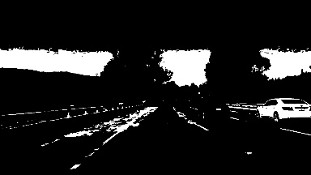
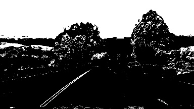
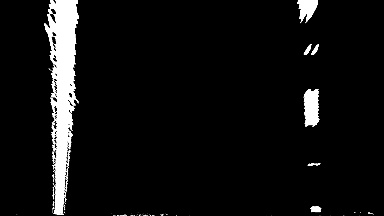
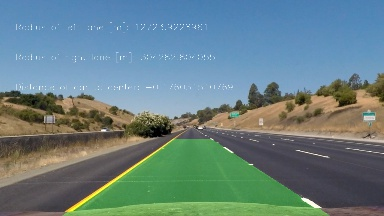
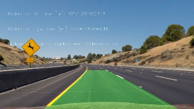
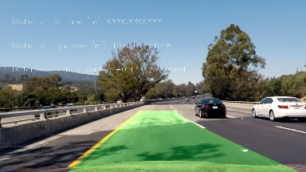
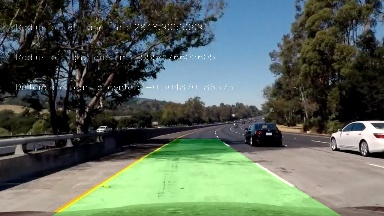
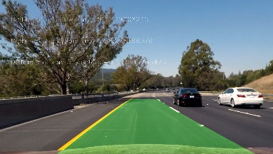

## Writeup

---

**Advanced Lane Finding Project**

The goals / steps of this project are the following:

* Compute the camera calibration matrix and distortion coefficients given a set of chessboard images.
* Apply a distortion correction to raw images.
* Use color transforms, gradients, etc., to create a thresholded binary image.
* Apply a perspective transform to rectify binary image ("birds-eye view").
* Detect lane pixels and fit to find the lane boundary.
* Determine the curvature of the lane and vehicle position with respect to center.
* Warp the detected lane boundaries back onto the original image.
* Output visual display of the lane boundaries and numerical estimation of lane curvature and vehicle position.

[//]: # (Image References)

[video1]: ./project_video.mp4 "Video"

## [Rubric](https://review.udacity.com/#!/rubrics/571/view) Points

### Here I will consider the rubric points individually and describe how I addressed each point in my implementation.  

---

### Writeup / README

### Camera Calibration

#### 1. Briefly state how you computed the camera matrix and distortion coefficients. Provide an example of a distortion corrected calibration image.

In the file 'camera_calibration.py' there is the function 'calibrate_camera'. A folder which should contain the images is passed to the function as well as the number of grids in x and y.
The user can specify if the result should be saved and if the logfile should be saved. The logfile contains a protocol of the process.

For each image the function 'corner_detection' is called first in which the image is converted to grayscale and after that the opencv function cv2.findChessboardCorners is called. It returns the corner matrix.

To transform the image an array of object points is needed (variable objp in 'camera_calibration.py', line 15). The array objp should represent the chessboard corner in the world frame which is assumed to be planar. Since this is the same for every image the array objp is appended to the array objpts for every image.
The image points are the identified corners of the chessboards and are appended to the array imgpts for every image.

To get the calibration coefficients the opencv function cv2.calibrateCamera is called ('camera_calibration.py', line 40) which calculates the coeffs based on the objpts and imgpts array.
If defined by the user the coefficients will be saved as pickle file. Same goes for the logfile which is saved as textfile.

 
 
 
 
 

### Pipeline (single images)

#### 1. Provide an example of a distortion-corrected image.

To demonstrate this step, I will describe how I apply the distortion correction to one of the test images like this one:

Original and undistored example:


#### 2. Describe how (and identify where in your code) you used color transforms, gradients or other methods to create a thresholded binary image.  Provide an example of a binary image result.

The method used consists of using single channels of 3 color spaces plus the sobel gradient calculation in x direction.
A combination of the used for the output image.

The images are first undistorted. Then a gamma correction if 0.3 is done to have more seperation of the lines and the tarmac.

Of the BGR color space the R and G channels are used. Lane lines always have R components as well as G components (usually white or yellow lines).
To not run into the issue to also have a yellowish tarmac included an elementwise matrix multiplication of R and G channel is performed to only catch pixels that have both components ('image_transform.py', line 47-54).

R binaries:


G binaries:



Combined R and G binaries:


Of the HLS color space the S channel is used ('image_transform.py', line 55-59):



Of the HSV color space the V channel is used ('image_transform.py', line 61-65):


And last but not least a binary of the sobel gradient in the x-direction of a grayscale image is used ('image_transform.py', line 67-74):


#### 3. Describe how (and identify where in your code) you performed a perspective transform and provide an example of a transformed image.

The perspective transformation is done if defined by the user when the function 'image_trafo' is called ('image_transformation.py', line 80-85). If that is the case the function 'persp_transform' is called ('image_transformation.py', line 90-98).
Under the assumption that the camera position is constant the following source and destination points are hardcoded:
 

```python
dst = np.float32([(475+offset, 100), (200+offset, imshape[1]-100), (imshape[0]-475+offset, 100), (imshape[0]-200+offset, imshape[1]-100)])
src = np.float32([(605, 470), (180, imshape[1]), (imshape[0] - 605, 470), (imshape[0] - 180, imshape[1])])
```

An offset is implemented to consider a lateral camera offset.

The image and perspective transformed output looks like this:



#### 4. Describe how (and identify where in your code) you identified lane-line pixels and fit their positions with a polynomial?

There two different methods to identify the lane lines in the file 'fit_lane.py'. For the first fit the function 'init_fit_line' (line 6-99) is used.
Once the line was fitted once the function 'similar_fit_line' is called (line 102-156).

The initial line fit slices the image horizontically. Additionally every slice is divided to left and right. Then a histogram is calculated. The peak of the histogram indicates the lane line for the current window and side.
Once you have the peak of each window an second order polynomial can be fitted to the peaks and y position of the windows.

The similar fit function takes the current fit of the lane lines and looks for pixels around the current fit +/- a margin (fit_lane.py, line 109-116). Then a second-order polynomial is fitted through the found pixels.
Additionally there is filter implemented which only allows the newly found coefficients have a certain deviation from the last fit. If this is exceeded the average fit of the last 5 frames is used.


#### 5. Describe how (and identify where in your code) you calculated the radius of curvature of the lane and the position of the vehicle with respect to center.

The function to calculate the current curvature of the lane line is in 'fit_lane.py' and is called 'meas_curv', line 158-184.
A second-order polynomial is fitted through scaled x,y-values to represent meters instead of pixels. The coefficients of the fit are then used to calculate the curvature in meters.


#### 6. Provide an example image of your result plotted back down onto the road such that the lane area is identified clearly.

The function in the file 'fit_lane.py' named 'draw_lane', lines 187-231, draws the area.









---

### Pipeline (video)

#### 1. Provide a link to your final video output.  Your pipeline should perform reasonably well on the entire project video (wobbly lines are ok but no catastrophic failures that would cause the car to drive off the road!).

[Video](./project_video_output.mp4)

---

### Discussion

#### 1. Briefly discuss any problems / issues you faced in your implementation of this project.  Where will your pipeline likely fail?  What could you do to make it more robust?

The biggest issue are changes in ambient light or when the tarmac becomes very light. Those are the use cases the pipeline is most likely to fail.
It was tried to overcome that issue with the gamma correction. A histogram normalization could be tried as a step further.
